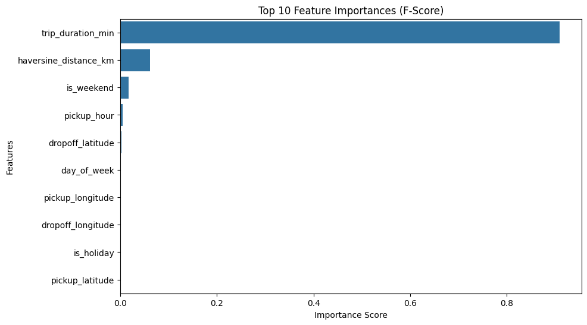
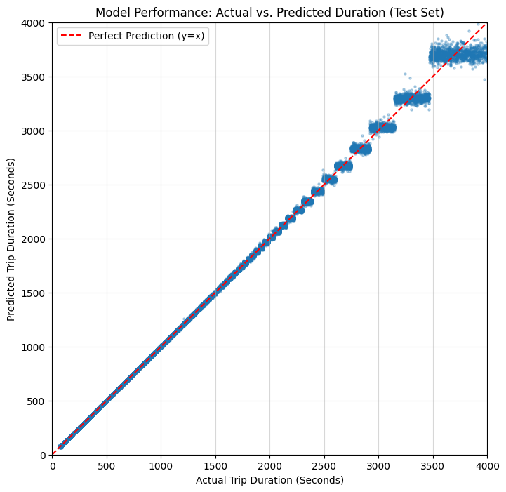
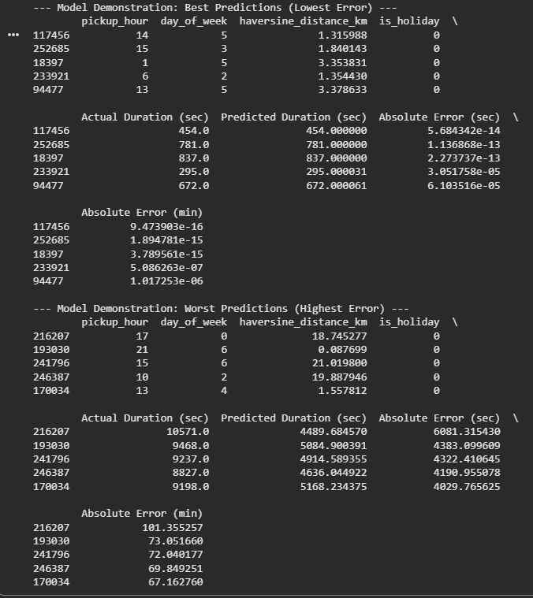

# 🚕 AI-Driven Taxi Trip Duration Prediction
We use driver instinct and custom **Holiday Feature**.

Traffic patterns change dramatically on holidays. By integrating a **US Federal Holiday calendar**, the model learns that:
- A Monday ≠ a regular Monday if it’s **Labor Day**

This significantly improves prediction accuracy.

---

### 3.3 Feature Engineering Pipeline
- **Haversine Distance:**  
  Converts GPS coordinates into straight-line distance (km)
- **Time Decomposition:**  
  - Hour of day  
  - Day of week  
  - `Is_Holiday` flag
- **Data Cleaning:**  
  Removed impossible trips (e.g., 1 second or 24 hours)
- **Log Transformation:**  
  Applied `log(1 + trip_duration)` to reduce skew from extreme outliers

---

## 04 — Proof of Concept & Experiments

### 4.1 Testing Strategy
A strict dataset split was used:

- **60% Training** – Model learning  
- **20% Validation** – Hyperparameter tuning  
- **20% Test** – Final evaluation (never seen before by the model)

---

### 4.2 Results
- **Metric:** Root Mean Squared Error (RMSE)  
- **Final Test RMSE:** `0.0138 on log scale` and on average prediction is off by 51.91 seconds

**Key Insights**
- Distance, hour and weekend are the most important feature
- The holiday feature reduces late-year prediction errors
 

---

### 4.3 Model Demonstration
 

**5 Good and worst predictions**

---
### 4.4 Data source and training
To replicate this project, download the raw data from Kaggle
- Go to the [NYC Taxi Trip Duration Competition](https://www.kaggle.com/competitions/nyc-taxi-trip-duration).
- Download train.csv.
- Place it in the same folder as the notebook.
- The script will automatically perform a 60/20/20 split (Train/Validate/Test) to ensure the model isn't just memorizing data.

---

## 05 — Discussion & Challenges

### 🚧 Real-World Limitations
Even with **85%+ accuracy**, real driving experience reveals limitations, Driving in Poznań taught me that. One broken-down bus on a bridge can destroy an AI's prediction. The model is strong, but without real-time weather data and live road closure feeds, there will always be a 5-10% error rate caused by "unseen chaos.":

- **Accidents:** Sudden crashes cannot be predicted
- **Weather:** Rain can slow a city by ~20% (not yet modeled)
- **Human Behavior:** Passenger delays introduce noise into the data

**Future Improvement:**  
Integrate a weather API to enhance realism.

---

## ▶️ How to Run the Demo
1. Load `taxi_duration_model.pkl`(brain) and `taxi_test_data.csv`(test cases)
2. Open the notebook
3. Run the demo cell in the notebook
4. Input a trip index to compare:
   > *AI prediction vs. real NYC taxi outcome*

---
### Final Summary
This project proves that with the right "hand-crafted" features (like holiday logic and Haversine math), a lightweight model can provide high-value predictions that are useful for real-world taxi operations.
